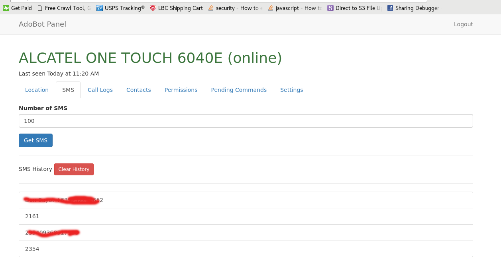
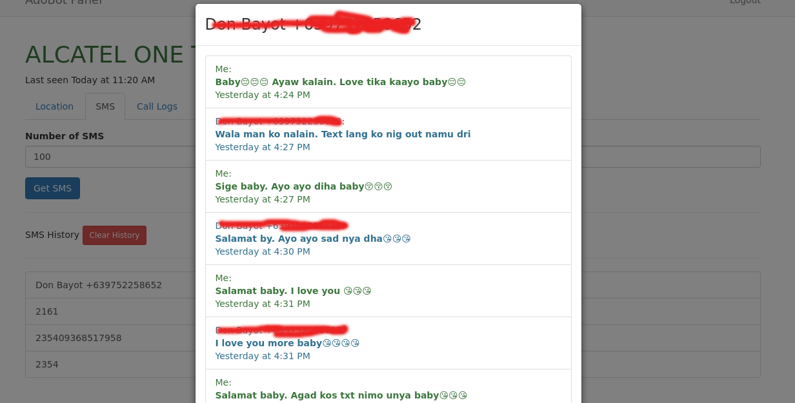

# AdoBot
AdoBot spyware android client

# Features
 - hidden app icon (stealth mode)
 - get sms in realtime or scheduled
 - get call logs in realtime or scheduled
 - get contacts
 - monitor location
 - update apk remotely
 - data collected are retained in database
 - realtime notifications about device status
 - For android 6 and above:
   - You can view the permissions of the app
   - The app asks for permission when a certain command is sent the there is no permission

# Instructions

Edit `CommonParams.java` and change the `PRODUCTION_SERVER` variable to the address of your [AdoBot-IO](https://github.com/adonespitogo/AdoBot-IO) server. Next, checkout [AdoBot-IO](https://github.com/adonespitogo/AdoBot-IO) on how to setup the NodeJS server.

# Screen Shots

## Main GUI

## Location Tab

## Main SMS Tab

## Single SMS Thread View

SMS thread is a pop up modal

## Call Logs Tab

## Contacts Tab

## Pending Commands Tab

When you send a command to an offline device, the command is stored in the datase and will be executed once the device connects online.

## Update APK 

## Notifications

